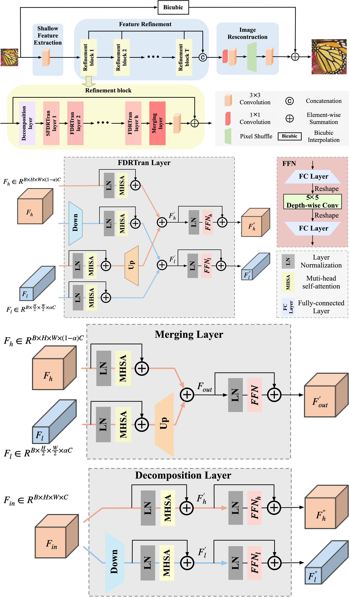
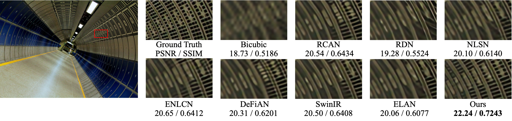

# Image Super-Resolution via Efficient Transformer Embedding Frequency Decomposition With Restart

Yifan Zuo , Wenhao Yao , Yuqi Hu , Yuming Fang , Wei Liu , and Yuxin Peng , "Image Super-Resolution via Efficient Transformer Embedding Frequency Decomposition With Restart", IEEE TIP, 2024 [[paper](https://ieeexplore.ieee.org/document/10643469)]

---

> **Abstract:** *Recently, transformer-based backbones show superior performance over the convolutional counterparts in computer vision. Due to quadratic complexity with respect to the token number in global attention, local attention is always adopted in low-level image processing with linear complexity. However, the limited receptive field is harmful to the performance. In this paper, motivated by Octave convolution, we propose a transformer-based single image super-resolution (SISR) model, which explicitly embeds dynamic frequency decomposition into the standard local transformer. All the frequency components are continuously updated and re-assigned via intra-scale attention and inter-scale interaction, respectively. Specifically, the attention in low resolution is enough for lowfrequency features, which not only increases the receptive field, but also decreases the complexity. Compared with the standard local transformer, the proposed FDRTran layer simultaneously decreases FLOPs and parameters. By contrast, Octave convolution only decreases FLOPs of the standard convolution, but keeps the parameter number unchanged. In addition, the restart mechanism is proposed for every a few frequency updates, which first fuses the low and high frequency, then decomposes the features again. In this way, the features can be decomposed in multiple viewpoints by learnable parameters, which avoids the risk of early saturation for frequency representation. Furthermore, based on the FDRTran layer with restart mechanism, the proposed FDRNet is the first transformer backbone for SISR which discusses the Octave design.* 





---

## Dependencies

- Python 3.8
- PyTorch 2.0.0
- NVIDIA GPU + [CUDA](https://developer.nvidia.com/cuda-downloads)

```bash
# Clone the github repo and go to the default directory 'FDRNet'.
git clone https://github.com/catnip1029/FDRNet.git
conda create -n FDRNet python=3.8
conda activate FDRNet
pip install -r requirements.txt
python setup.py develop
```

---

## Datasets

Used training and testing datasets as follows:

| Training Set                                                 |                 Testing Set                 |
| :----------------------------------------------------------- | :-----------------------------------------: |
| [DIV2K](https://data.vision.ee.ethz.ch/cvl/DIV2K/) (800 training images, 100 validation images) +  [Flickr2K](https://cv.snu.ac.kr/research/EDSR/Flickr2K.tar) (2650 images) | Set5 + Set14 + BSD100 + Urban100 + Manga109 |

Download training and testing datasets and put them into the corresponding folders of `datasets/`. 

------

## Training

- Download [training](https://drive.google.com/file/d/1TubDkirxl4qAWelfOnpwaSKoj3KLAIG4/view?usp=share_link) (DIV2K or DF2K, already processed) and [testing](https://drive.google.com/file/d/1yMbItvFKVaCT93yPWmlP3883XtJ-wSee/view?usp=sharing) (Set5, Set14, BSD100, Urban100, Manga109, already processed) datasets, place them in `datasets/`.

- Run the following scripts. The training configuration is in `options/train/OctaveIR/`.

  ```shell
  # FDRNet, input=48x48, scale=4, dataset=DIV2K
  torchrun --nproc_per_node=2 --master_port=4321 basicsr/train.py -opt options/train/OctaveIR/train_OctaveIR.yml --launcher pytorch --auto_resume
  ```
  
- The training experiment is in `experiments/`.

## Testing

- Pre-trained models in `pretrain_models/`. Testing datasets [Set5, Set14] in `datasets/`.

- The testing configuration is in `options/test/OctaveIR/`.

  ```shell
  # FDRNet, scale=4, datasets=Set5, Set14
  python basicsr/test.py -opt options/test/OctaveIR/test_OctaveIR.yml
  ```

- The output is in `results/`.

## Citation

If you find the code helpful in your research or work, please cite the following paper(s).

```
@article{zuo2024image,
  title={Image Super-resolution via Efficient Transformer Embedding Frequency Decomposition with Restart},
  author={Zuo, Yifan and Yao, Wenhao and Hu, Yuqi and Fang, Yuming and Liu, Wei and Peng, Yuxin},
  journal={IEEE Transactions on Image Processing},
  year={2024},
  publisher={IEEE}
}
```

## Acknowledgements

This code is built on  [BasicSR](https://github.com/XPixelGroup/BasicSR).
